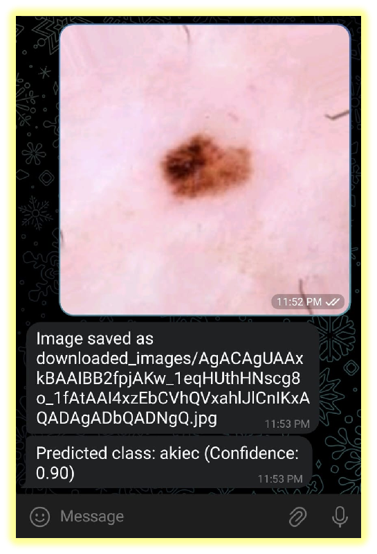

# Skin Disease Detection Using MobileNet on Raspberry Pi with Telegram Bot

This project implements a lightweight skin disease detection system using MobileNet, designed to run on Raspberry Pi for real-time image analysis. A Telegram bot is integrated to notify users instantly with predictions and confidence scores.

---

## 🧠 Overview

- Real-time classification of skin diseases using pre-trained MobileNet
- Deployed on Raspberry Pi for portability and low-cost setup
- Integrated with Telegram bot to send diagnosis results via chat
- Ideal for remote or field-level diagnostics without needing a laptop or internet browser

---

## 🛠️ Tech Stack

- **Language**: Python
- **Model**: MobileNet (TensorFlow/Keras)
- **Device**: Raspberry Pi 4 (or 3)
- **Interface**: Telegram Bot API
- **Camera**: Raspberry Pi Camera Module

---

## The model is trained to classify the following seven skin conditions:

1. Actinic Keratoses and Intraepithelial Carcinoma (AKIEC)  
2. Basal Cell Carcinoma (BCC)  
3. Benign Keratosis-like Lesions (BKL)  
4. Dermatofibroma (DF)  
5. Melanoma (MEL)  
6. Melanocytic Nevi (NV)  
7. Vascular Lesions (VASC)
   
---

## Output

